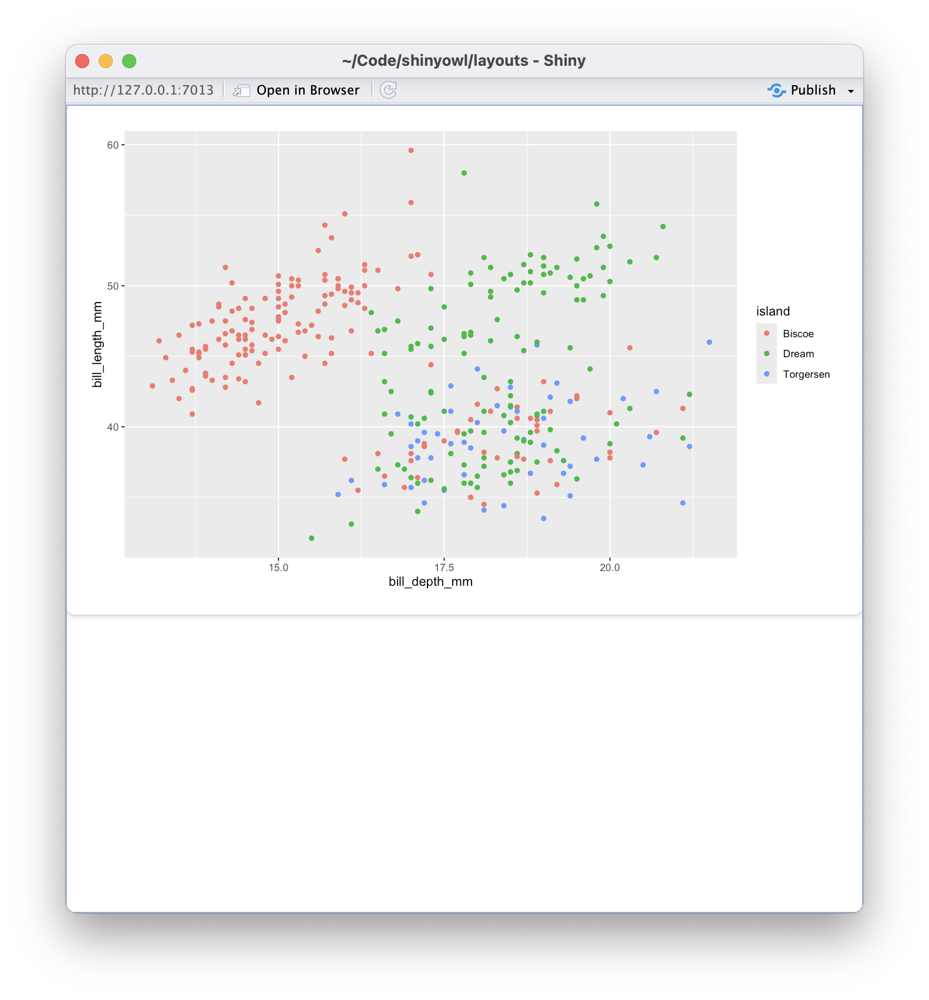
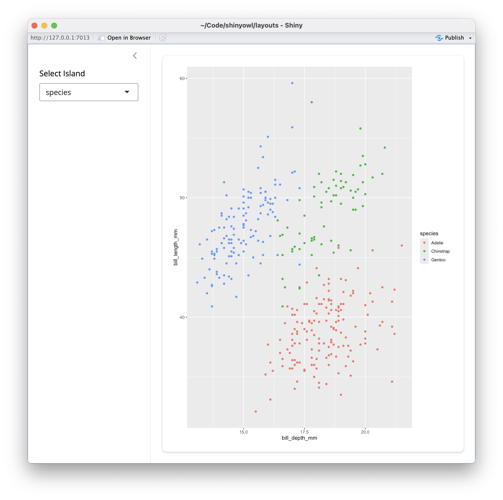
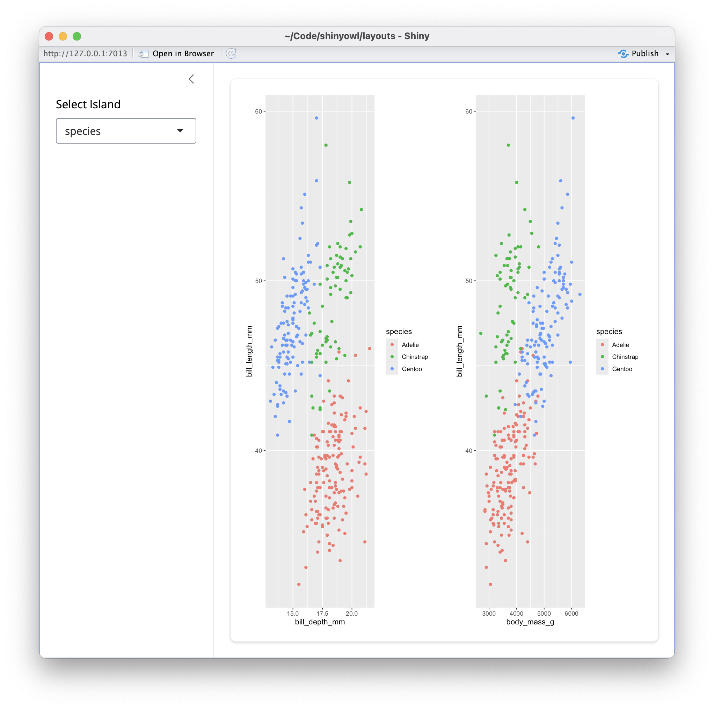
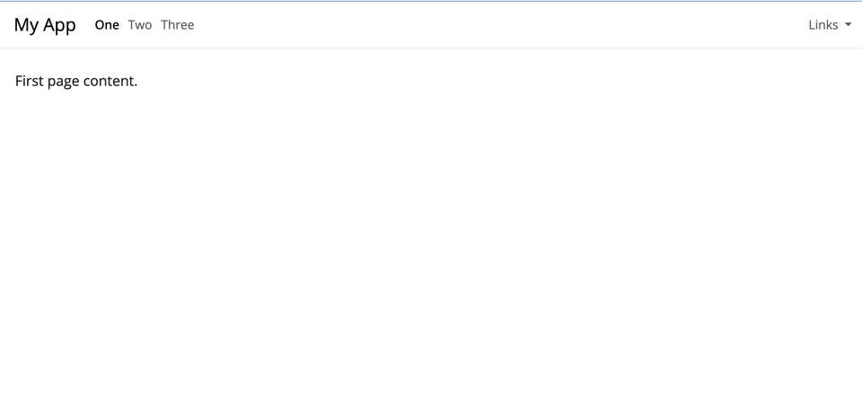

## Learning Objectives

By the end of this session, you should be able to:

- **Layout** your shiny app using `{bslib}`
- **Style** your shiny app using `bslib::bs_themer()`
- **Style** your shiny app plots using `{thematic}`
- **Create** a `brand.yml` that works with shiny apps
- **Utilize** `rintrojs`` to give help for your shiny app

## What are Shiny UIs?

- Underneath, it's HTML + JavaScript
- Built on a library called Bootstrap
- JavaScript gives us the power to update parts of the HTML dynamically

## Language of the Web
::::{.columns}
:::{.column}
### Shiny

```r
dept_choices <- c("Ancient Near Easter Art", "American")
selectInput(
  "dept",
  "Select Department",
  choices = dept_choices
)
```
:::
:::{.column}
### HTML

```html
<div class="form-group shiny-input-container">
  <label class="control-label" id="dept-label" for="dept">
    Select Department
  </label>
  <div>
    <select id="dept" class="form-control">
      <option value="Ancient Near Easter Art" selected>Ancient Near Easter Art</option>
      <option value="American">American</option>
    </select>
  </div>
</div>
```
:::
::::

# Layout Your Shiny App with `{bslib}`

## What is `{bslib}`?

- Short for **B**oot**s**trap**Lib**rary
- Code for layout as dashboards
- Allows for applying theming / `brand.yml`

```{r}
library(bslib)
library(bsicons)
library(shiny)
```

## Components of `{bslib}`

- card
- sidebars
- value boxes

## Layouts

- `layout_sidebar()`
- `layout_column_wrap()`
- `layout_columns()`

## Pages

- `page_sidebar()`/`sidebar()`
- `page_navbar()`/ `navbar()`
- `page_fillable()`/`layout_`


## Cards {auto-animate=true}

```{r}
#| eval: false
library(bslib)
ui <- page(
  card({
    plotOutput("penguins")
  })
)
```

- `runApp("layouts/app_card.R")`

##



## `page_sidebar()` {auto-animate=true}

```{r}
#| eval: false
library(bslib)
ui <- page_sidebar(
  sidebar = sidebar(
    selectInput("var", "Select Island",
      choices,
      selected = choices[1]
    )
  ),
  card({
    plotOutput("penguins")
  })
)
```

- `runApp("layouts/app_sidebar.R")`

##



## `layout_column_wrap()` {auto-animate=true}

```{r}
#| eval: false

choices <- c("sex", "island", "species")
ui <- page_sidebar(
  sidebar = sidebar(
    selectInput("var", "Select Island", 
                choices, 
                selected = choices[1])
  ),
    layout_column_wrap(
      card(plotOutput("penguins")),
      card(plotOutput("penguins2"))
    )
)

ui
```

- `runApp("layouts/app_layout_column.R")`

##



## Value Boxes

```{r}
#| echo: true
value_box(
  title = "I got",
  value = "99 problems",
  showcase = bs_icon("music-note-beamed"),
  p("bslib ain't one", bs_icon("emoji-smile")),
  p("hit me", bs_icon("suit-spade"))
)
```


## Dynamic Value Box

See `runApp("layouts/app_bslib_box_dynamic.R")`

## Laying out value boxes

```{r}
#| echo: false
vbs <- list(
  value_box(
    title = "1st value",
    value = "123",
    showcase = bs_icon("bar-chart"),
    theme = "purple",
    p("The 1st detail")
  ),
  value_box(
    title = "2nd value",
    value = "456",
    showcase = bs_icon("graph-up"),
    theme = "teal",
    p("The 2nd detail"),
    p("The 3rd detail")
  )
)
```

```{r}
page_fillable(
  layout_column_wrap(
    width = "250px",
    fill = FALSE,
    vbs[[1]], vbs[[2]]
  ),
  card(
    min_height = 200,
    plotly::plot_ly(x = rnorm(100))
  )
)
```

## Exercise

Modify the `value_box` code in `layouts/app_bslib_box_layout.R`. Try out the following:

- Different colors: check out [R-Gallery's Color Picker](https://r-graph-gallery.com/color-palette-finder)
- Different icons: check out [Bootstrap Icons](https://icons.getbootstrap.com/)
- Different content

If you like, paste it into the Cascadia-R slack channel.

```{r}
countdown::countdown(minutes = 5)
```


## navbars

```{r}
#| eval: false
#| code-line-numbers: "1|3-5|6|7-12"
ui <- page_navbar(
  title = "My App",
  nav_panel(title = "One", p("First page content.")),
  nav_panel(title = "Two", p("Second page content.")),
  nav_panel("Three", p("Third page content.")),
  nav_spacer(),
  nav_menu(
    title = "Links",
    align = "right",
    nav_item(link_shiny),
    nav_item(link_posit)
  )
)
```

- `runApp("layouts/app_navbar.R")`
- [Carson Sievert: Customizing Navbars using {bslib}](https://www.youtube.com/watch?v=VNbab8bro2c)

##



# Styling Your App

## Design/HTML is all about containers

```{r}
#| eval: false
#| code-line-numbers: "1,11|5,10"
<div class="form-group shiny-input-container">
  <label class="control-label" id="dept-label" for="dept">
    Select Department
  </label>
  <div>
    <select id="dept" class="form-control">
      <option value="Ancient Near Easter Art" selected>Ancient Near Easter Art</option>
      <option value="American">American</option>
    </select>
  </div>
</div>
```


## Cascading Style Sheets (CSS)

Set of **rules** that define how HTML content is **presented** in the browser

```html
selector {
  property1: value;
  property2: value;
}
```

<br>

* **selector** defines which elements on page to apply rule
* **property list** set properties of elements to specific values

## Customizing CSS in Shiny (1)

:::: {.columns}

::: {.column width="55%"}

```r
ui <- fluidPage(
  tags$head(
    tags$style(
      HTML("
      body {
        background-color: blue;
        color: white;
      }")
    )
  ),
  # application UI
  ...
)
```

:::

::: {.column width="45%"}

* `tags` originates from `{htmltools}`, but imported with `{shiny}`

:::

::::

# The good news: you don't have to learn CSS

## Built in Bootstrap Themes


## Style your App with `{bslib}` and `{thematic}`

- put `bslib::bs_themer()` as an argument to `bslib::ui_*()` functions
- add `thematic::thematic_theme()` to the app code (before `runApp()`)
- use `run_with_themer()` on an app to style it

## Example:

```{r}
#| eval: false
#| code-line-numbers: "1-2|7|"
choices <- c("species", "island") 
theme_shiny <- bs_theme(brand=TRUE)

ui <-  page_sidebar(
  theme=theme_shiny,
  sidebar=sidebar(
  selectInput("variable", "Select Variable to color by", choices)),
  plotOutput("my_plot"), 
)

thematic::thematic_shiny()
```


## Exercise

Try running the following code below and change the `background` and `foreground` variables, as well as `primary` and maybe even the font. Cut and paste your `bs_theme_update()` code into the Slack to share your creation.

```r
library(bslib)
run_with_themer("layouts/app_bs_themer.R")
```

```{r}
countdown::countdown(minutes = 5)
```

## Full List of Bootstrap Options

- [Bootstrap Variables](https://rstudio.github.io/bslib/articles/bs5-variables/index.html)

# Be on brand with `brand.yml`

## What is `brand.yml`?

- YAML file that has your brand defaults
  - usually `_brand.yml`
- When your org has branded colors, logos, and fonts
- Top level way to specify:
  - Colors
  - Fonts
  - Logos
- Works well with other styling


## `brand.yml` compatibility

- **Shiny layouts (including `bslib`)**
- **`thematic` plot styling**
- Quarto Dashboards
- PDF (via typst)
- HTML outputs (`revealjs`)

## `brand.yml` example

```{yml}
#| code-line-numbers: "1-4|5-14|15-19|21-27"
logo:                          #set logo
  small: owl-logo.png
  medium: owl-logo.png
  large: owl-logo.png

color:
  palette:                     #set color values (for elements)
    black: "#1A1A1A"
    white: "#F7F7F7"
    light-yellow: "#ECE58B"
    grey: "#908D90"
    pink: "#FFeD8F"
    bg: "#413041"
    fg: "#EEE8D5"
  foreground: light-yellow    #set colors for elements
  background: bg
  primary: grey
  danger: pink
  dark: "#413041"

typography:                  #set fonts
  fonts:
    - family: Roboto
      source: google
  base: Roboto
  headings: Roboto
  monospace: Courier
```


## Using `_brand.yml` with `bslib`

```{r}
#| eval: false
#| code-line-numbers: "1|4"
current_theme <- bs_theme(brand=TRUE)        #enable brand.yml

ui <-  page_sidebar(
  theme = current_theme,                     #use theme

  sidebar= sidebar(
    selectInput("variable", "Select Variable to color by", choices)),

  plotOutput("my_plot")
)
```

## Order of Priorities
::::{.columns}
:::{.column}
```{mermaid}
%%| echo: false
graph TD
  A["brand.yml"] --> B["bs_theme()"] 
  B --> C["custom.scss"]
  B --> D["thematic"]
```
:::
:::{.column}
- `brand.yml` takes precedence
- Can override styles with `bs_theme()`
- Themes will be *auto* populated from `brand.yml` into `bslib()` layouts and plots using `thematic()`
- Customize for specific classes with `.scss` file
:::
::::

## Exercise

- In your project, look at the `_brand.yml` file and try uncommenting the various lines, especially `foreground` and `background` 
- Reload `app_bs_themer.R` and see changes.
- Try running `run_with_themer()` for the app and apply the themes again
- How does the `_brand.yml` affects the themes?

```r
library(bslib)
run_with_themer("layouts/app_bs_themer.R")
```

```{r}
countdown::countdown(minutes = 5)
```


## Overriding `brand.yml`

- May want to add more styling to specific elements
- Can add a `.scss` file. 
- [Bootstrap Variables](https://rstudio.github.io/bslib/articles/bs5-variables/index.html)


# Improving User Experience (UX)

## Accessibility

Prioritizing accessibility leads to better UX!

::: {.nonincremental}
* Keyboard navigation (without mouse)
* Visualization color palettes accounting for vision deficiencies
* Metadata for HTML tag attributes 
:::

## `{rintrojs}`

- I used to show `{cicerone}` - but that project is now depracated
- `{rintrojs}` - walk through UI elements
    - each UI elemnt needs to be wrapped in `introBox()`
    - add `data.step` and `data.intro` to each UI element.

## Example

```{r}
#| eval: false
#| code-line-numbers: "2|4,10|7|8-9"
  tabPanel("Tree Explorer",
           rintrojs::introjsUI(),             #initialize rintrojs
           actionButton("help", "Help", icon = icon("circle-question")),
           introBox(                           #Wrapper for UI element
           selectInput("covariates", "Click Box to Add Covariates", 
                       choices = covariateNames, multiple=TRUE),
           data.step = 1,                      #Step Number
           data.intro = "<p>Welcome to the Palmer Penguin dataset. We're going to try to predict the Species of Penguin (Adelie, Chinstrap, Gentoo) using a conditional inference decision tree using the {party} package.
           Click the selector box to start adding a feature to the model."
            ),                                 #Wrapper for UI element

```

- Try the example at <https://tladeras.shinyapps.io/penguin_party/>
- Code is here: <https://github.com/laderast/partyExplorer>

## Resources

- [Beautify with Bootstrap](https://unleash-shiny.rinterface.com/beautify-with-bootstraplib)
- [Shiny in Production: Design and UX](https://shinyprod.com/units/d1-03-design-ux.html)
- [Carson Sievert: Towards the Next Generation of UI](https://www.youtube.com/watch?v=avZ7TDTRnVo)
